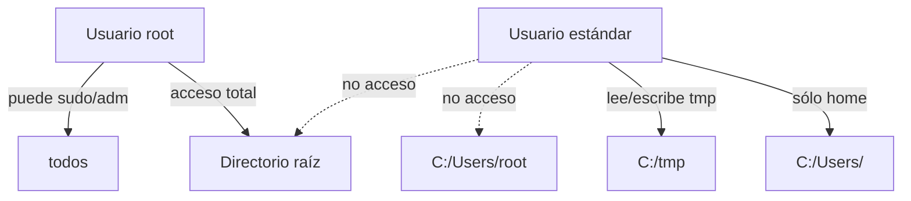

# Política de Acceso y Seguridad de Usuarios - X64DOS
> **Cumplimiento:** ISO/IEC 12207, 25010, 15504, 27001, 9001.  
> **Documento versionado y auditado.**  
> **Revisión:** 2026-05-14, **Responsable:** Equipo X64DOS

- Cada usuario posee un workspace exclusivo `C:\Users\<usuario>`
- Directorio raíz y `C:\Users\root` sólo accesibles por root
- Login/password obligatorio y verificado en cada sesión
- Sudo sólo permitido para root (los intentos de otros usuarios se registran)
- Ningún usuario puede ejecutar scripts fuera de su home
- Todos los scripts se auditan (registro obligatorio usando logging estándar industrial en `/fs/example_audit.log`). Ejemplo y plantilla en scripts/log_event.lua y docs/09-Apendice-Tecnico-MultiFS.md.
- Ningún usuario puede alterar/borrar logs salvo root. Políticas de segregación y revisión periódica aplican.

## Diagrama Mermaid de Acceso

